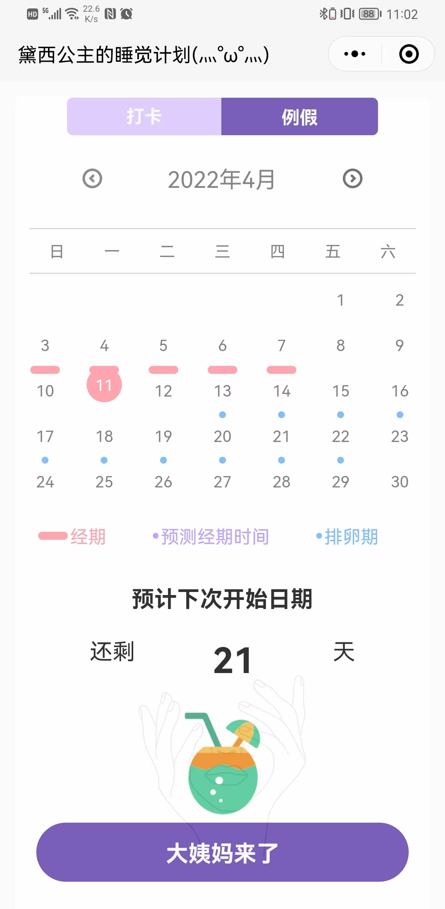
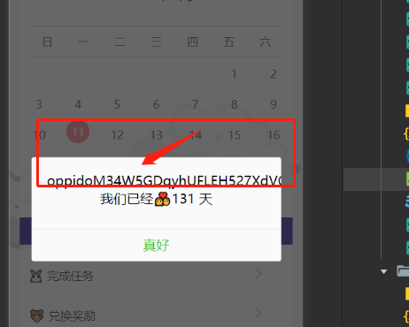
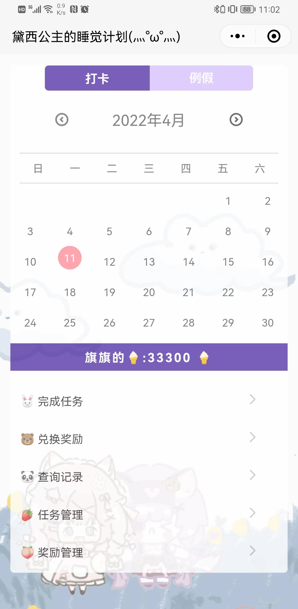
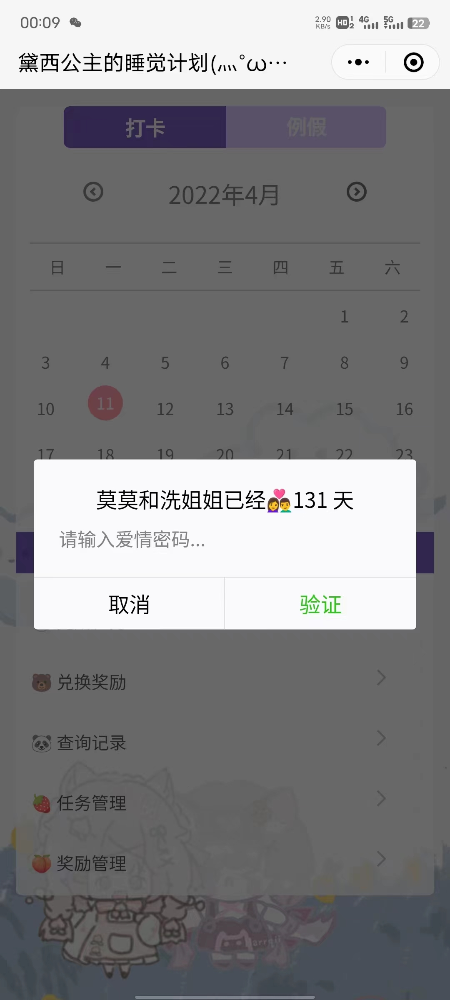
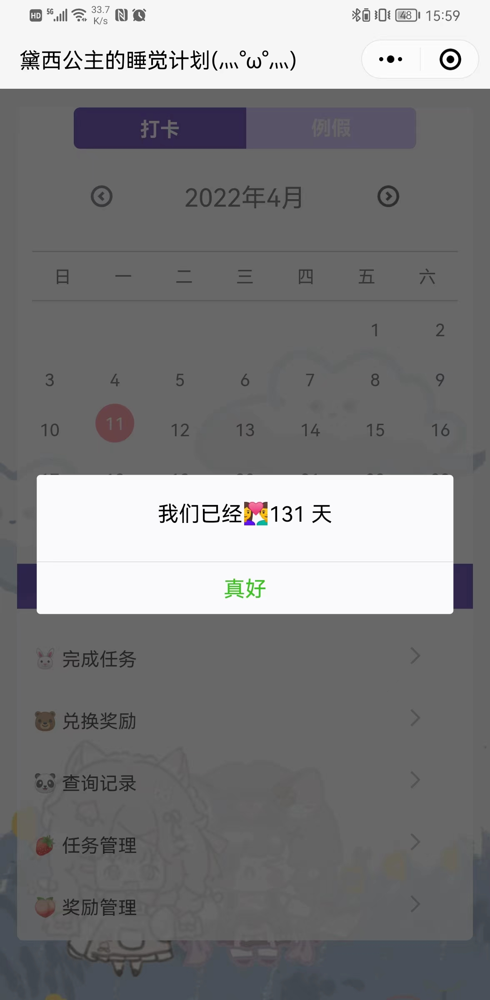

# 女友小程序扩展
>项目为 `https://github.com/LCM9902/Duck-Princess-Cultivation-Plan`基础扩展，新增日历功能，例假记录功能

# 缺陷
- 例假数据存储为缓冲
- 打卡日历待添加点击事件

# Duck-Princess-Cultivation-Pla项目注意事项
### 数据库设计
https://bytedance.feishu.cn/docx/doxcnvk58QcRZxmOmHgogANvnQu

### 注意点
1. 确认project.config.json中的projectname和本地是否一致
2. miniprogram/envList.js中的环境配置改为自己的环境
3. 需要手动创建数据库表：云开发 -> 数据库
4. 已修复兑换bug
5. 搭建教程在(http://www.moyilm.cn/GitHub/1.pdf)
### 配置相关
1. 修改游客密码在目录：miniprogram\pages\index\index.js的第228行 if(lovepassword!=undefined&&lovepassword=="你的密码"){
2. 修改日期在目录:miniprogram\pages\index\index.js的第210行   let anniversary_year = "xxxx-xx-xx";
3. 获取打印openid需在目录：miniprogram\pages\index\index.wxml的第6行与第9行 title=""字段在""加入 {{openid}} 例： title="{{openid}}我们已经👩‍❤️‍👨{{anniversary}} 天" 
4. 编译完成后 

### 参考文档

- [云开发文档](https://developers.weixin.qq.com/miniprogram/dev/wxcloud/basis/getting-started.html)

# 迭代1.2.0
- 新增云函数获取用户openID
- 新增不同用户页面展示弹框处理

